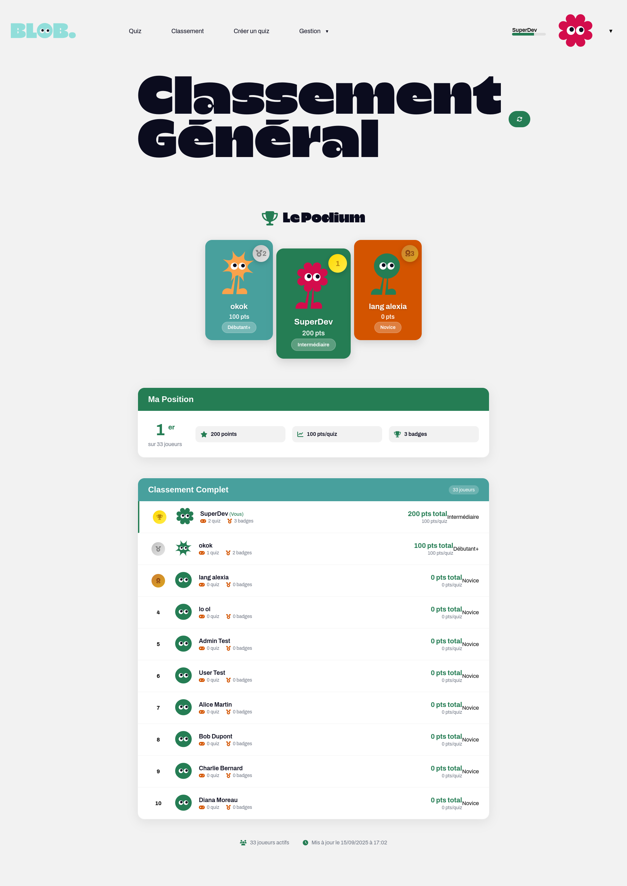
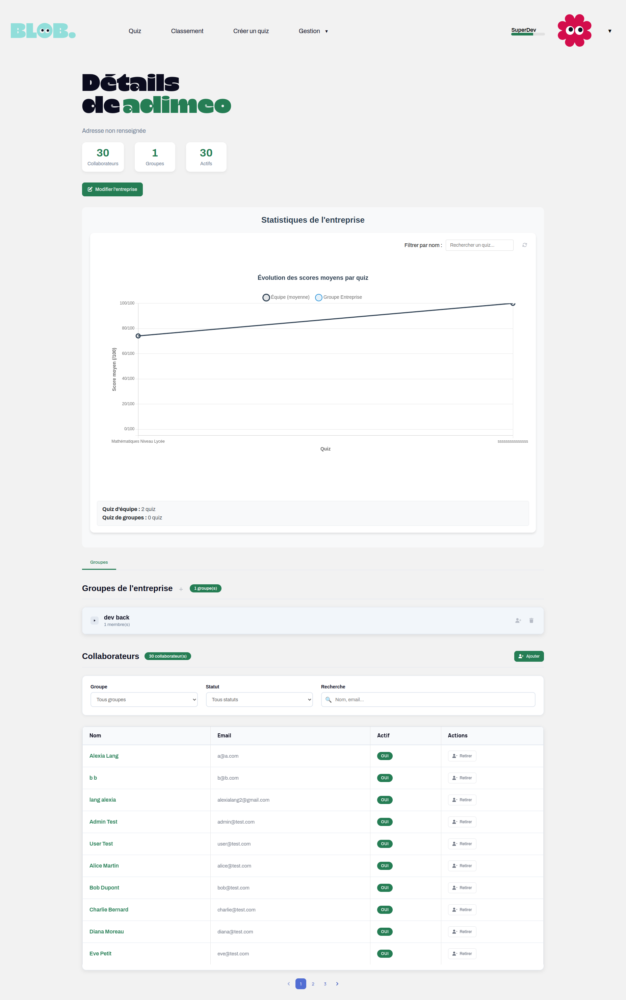

# Blob Quiz Platform
> **Plateforme SaaS de quiz interactifs pour entreprises**  
> *Projet fil rouge - Développeur Full Stack | Metz Numeric School 2024-2025*

[](https://angular.io/)
[](https://symfony.com/)
[](https://www.typescriptlang.org/)
[](https://php.net/)
[](https://docker.com/)

---

## Contexte et Expression du Besoin

**Blob** est une plateforme SaaS développée pour répondre aux défis de l'évaluation et de la formation des collaborateurs en entreprise. Le projet transforme les évaluations traditionnelles en expériences engageantes grâce à la gamification.

### Problématiques identifiées

Les outils traditionnels d'évaluation (tests écrits, auto-évaluations) présentent plusieurs limites :
- Manque de dynamisme et d'adaptabilité
- Faible engagement des collaborateurs  
- Absence de centralisation des résultats
- Difficulté de suivi des compétences

### Solution proposée

Blob transforme les évaluations en expériences stimulantes grâce à :
- Des quiz variés (QCM, associations, remises en ordre, blind tests)
- Un mode multijoueur en temps réel
- Un système de gamification avec badges et classements
- Des résultats centralisés et un suivi des performances

### Publics cibles

- **Responsables RH** : Suivi des compétences, orientation des formations
- **Managers** : Encouragement des équipes, analyse des performances  
- **Collaborateurs** : Amélioration des compétences dans un cadre ludique
- **Formateurs** : Dynamisation des séminaires et formations

---

## Démonstration

### Interface Utilisateur

| Fonctionnalité | Capture                                       | Description |
|----------------|-----------------------------------------------|-------------|
| **Connexion Sécurisée** |        | Authentification JWT + validation |
| **Inscription** |    | reCAPTCHA v3 + validation email |
| **Dashboard Quiz** |        | Filtrage par catégorie et difficulté |
| **Administration** |          | Gestion multi-tenant des utilisateurs |
| **Création Quiz** |     | 7 types de questions supportés |
| **Classements** |    | Gamification avec badges |
| **Mon Profil** |        | Statistiques détaillées et badges |
| **Mon Entreprise** |  | Gestion des collaborateurs et groupes |

### Gameplay et Fonctionnalités

#### Mode Solo
1. **Sélection** → Quiz par catégorie/difficulté
2. **Gameplay** → Questions variées avec feedback immédiat  
3. **Résultats** → Score, badges automatiques, historique

#### Mode Multijoueur (Temps réel)
1. **Salle** → Jusqu'à 10 joueurs simultanés
2. **Synchronisation** → Timer partagé via WebSockets
3. **Compétition** → Classement live, podium final

### Démonstrations de Gameplay

*Captures vidéo à venir - Mode solo et multijoueur*

---

## Analyse Fonctionnelle et Conception

### Objectifs SMART

#### Création et Gestion des Quiz
- **Spécifique** : Utilisateurs autorisés peuvent créer, modifier et supprimer leurs quiz avec différents types de questions
- **Mesurable** : Jusqu'à 50 questions par quiz, minimum 5 types de questions supportés
- **Atteignable** : Formulaire Angular + API Symfony + stockage en base de données
- **Réaliste** : Fonctionnalité fondamentale pour ce type d'application
- **Temporel** : Implémentation dès le début du projet

#### Participation aux Quiz
- **Spécifique** : Participation aux quiz avec scoring en temps réel
- **Mesurable** : Chargement en moins de 2 secondes, validation instantanée
- **Atteignable** : Optimisation des requêtes et du code
- **Réaliste** : Technologies Angular et Symfony adaptées
- **Temporel** : Priorité haute pour tester l'application

### Modélisation UML

Le projet suit une approche de modélisation complète avec :
- **Diagrammes de cas d'usage** : 3 rôles définis (Visiteur, Utilisateur, Admin)
- **Diagrammes d'activité** : Processus clés modélisés
- **Diagrammes de séquence** : Interactions entre composants
- **Diagramme de classes** : Structure des entités métier

### Rôles et Permissions

**Gestion par droits plutôt que par rôles métier** pour plus de flexibilité :
- **Visiteur** : Consultation limitée
- **Utilisateur** : Participation aux quiz, gestion de profil
- **Admin** : Tous les droits, attribution des permissions

---

## Architecture Technique

### Stack Technologique

L'architecture repose sur une séparation claire en 3 tiers :

```
┌─────────────────────────────────┐
│     Frontend Angular 19.2       │
│  ┌─────────────┐ ┌─────────────┐ │
│  │ Taiga UI    │ │ TypeScript  │ │
│  │ Charts.js   │ │ Animations  │ │
│  └─────────────┘ └─────────────┘ │
└─────────────────────────────────┘
                 │ REST API + WebSocket
┌─────────────────────────────────┐
│     Backend Symfony 7.2         │
│  ┌─────────────┐ ┌─────────────┐ │
│  │ JWT Auth    │ │ Mercure Hub │ │
│  │ Doctrine    │ │ Permissions │ │
│  └─────────────┘ └─────────────┘ │
└─────────────────────────────────┘
                 │
┌─────────────────────────────────┐
│   Infrastructure Docker          │
│  MariaDB 11.8 + RabbitMQ + Mail │
└─────────────────────────────────┘
```

### Choix Technologiques Justifiés

#### Frontend : Angular 19.2
- **Structure imposée** : Cadre de travail organisé pour la maintenabilité
- **TypeScript** : Typage fort et architecture bien définie
- **Alignement professionnel** : Technologie utilisée en entreprise

#### Backend : Symfony 7.2  
- **Architecture MVC** : Structure claire et composants réutilisables
- **Sécurité avancée** : Gestion fine des permissions et authentification
- **Expérience professionnelle** : Maîtrise du framework

#### Base de Données : MariaDB
- **Performance** : Optimisée pour les applications web
- **Compatibilité** : Doctrine ORM intégré
- **Fiabilité** : Solution éprouvée en production

### Architecture Multi-tenant Sécurisée

```php
// Système de permissions granulaires
enum Permission: string {
    case CREATE_QUIZ = 'CREATE_QUIZ';
    case MANAGE_USERS = 'MANAGE_USERS';
    case VIEW_RESULTS = 'VIEW_RESULTS';
}

// Isolation automatique par entreprise
private function canAccessSubject(User $authUser, mixed $subject): bool {
    if ($subject instanceof User) {
        return $this->sameCompany($authUser, $subject->getCompany());
    }
}
```

### 7 Types de Questions Implémentés

| Type | Complexité | Caractéristiques |
|------|------------|------------------|
| **QCM** | Intermédiaire | Choix unique, validation instantanée |
| **Choix Multiple** | Avancé | Sélection multiple avec scoring |
| **Associations** | Expert | Drag & drop, correspondances |
| **Remise en Ordre** | Avancé | Tri d'éléments, logique séquentielle |
| **Intrus** | Avancé | Identification d'éléments différents |
| **Vrai/Faux** | Basique | Questions binaires rapides |
| **Blind Test** | Expert | Intégration média, questions audio |

---

## Gestion de Projet

### Méthodologie Agile Appliquée

Le projet suit une approche inspirée de la méthode Agile avec :
- **4 phases principales** : Conception, Développement, Tests & Validation, Déploiement
- **Sprints de 1 à 4 semaines** : Développement itératif
- **Outils** : IceScrum pour la gestion Kanban et les User Stories

### Analyse des Risques

**10 risques identifiés** avec matrice impact/probabilité :

| Risque | Impact | Probabilité | Actions préventives |
|--------|--------|-------------|-------------------|
| **Temporel** : Mauvaise estimation | Élevé | Peu probable | Planning détaillé, suivi régulier |
| **Technique** : Bugs critiques | Très élevé | Peu probable | Tests avant mise en production |
| **Sécurité** : Attaques API | Très élevé | Peu probable | Validation stricte, rate limiting |
| **Performance** : Lenteur | Élevé | Probable | Optimisation code, cache |

### Fonctionnalités Avancées Implémentées

- **SSR + SEO** : Pré-rendu Puppeteer des pages publiques pour l'indexation
- **Google Analytics 4** : Tracking complet (G-95GW7QPNRH) + Google Tag Manager (GTM-PJ9GL9GB)
- **Rate Limiting** : Système custom anti-brute force spécifique au login
- **reCAPTCHA v3** : Score minimum 0.5 pour inscription et reset password
- **CORS sécurisé** : Configuration Nelmio avec domaines autorisés
- **Email automatisé** : Confirmation d'inscription via Symfony Messenger
- **Paiements Stripe** : Système de dons avec PaymentLinks
- **Refresh Tokens** : JWT auto-renouvelé (30 jours TTL)
- **Logging structuré** : Monolog avec rotation des logs
- **Cache optimisé** : Nginx gzip + cache statique (1 an)

---

## Sécurité et Conformité

### Mesures de Sécurité Implémentées

#### **Authentification Robuste**
- **Hachage** : Mots de passe avec `algorithm: auto` (bcrypt automatique)
- **Politique** : 8 caractères minimum + majuscule + minuscule + chiffre + caractère spécial
- **JWT** : Tokens avec clés RSA publique/privée + refresh tokens (30 jours TTL)
- **Vérification email** : Confirmation obligatoire via token unique

#### **Protection Anti-Attaques**
- **Rate limiting** : 5 tentatives de connexion max par IP (blocage 15min)
- **reCAPTCHA v3** : Score minimum 0.5 sur inscription et reset password
- **CORS** : Domaines autorisés uniquement (`blob.dev.local`)
- **Stateless** : API sans session, tokens JWT uniquement

#### **Contrôle d'Accès**
- **Permissions granulaires** : Système de droits par action (création quiz, admin...)
- **Voter custom** : Validation des autorisations avant chaque action sensible
- **Anonymisation** : Suppression RGPD avec anonymisation des données

### Conformité RGPD

- **Transparence** : Politique de confidentialité détaillée
- **Consentement** : Acceptation obligatoire lors de l'inscription  
- **Minimisation** : Collecte des données strictement nécessaires
- **Droits utilisateurs** : Accès, modification, suppression des données
- **Sécurisation** : Mots de passe hachés avec bcrypt

### Documentation API

- **Nelmio ApiDoc** : Documentation automatique Swagger UI
- **Annotations complètes** : Endpoints documentés avec @OA
- **Interface interactive** : Tests API via /api/doc

---

## Accessibilité et Normes

### Standards d'Accessibilité

- **Structure sémantique** : Balises HTML appropriées (header, nav, main, footer)
- **Navigation clavier** : Tous les éléments accessibles au clavier
- **Lecteurs d'écran** : Attributs ARIA et labels explicites
- **Contrastes** : Respect des normes WCAG (ratio 4.5:1 minimum)
- **Formulaires** : Labels liés, messages d'erreur descriptifs

### Tests d'Accessibilité

- **Lighthouse** : Score d'accessibilité global
- **DevTools** : Détection des erreurs WCAG
- **Lecteurs d'écran** : Tests avec Orca
- **Daltonisme** : Simulation des déficiences visuelles

### Normes de Sécurité

- **ISO/IEC 27001** : Gestion de la sécurité de l'information
- **CNIL** : Recommandations pour la protection des données
- **Éco-conception** : Optimisation des performances et de l'impact environnemental

---

## Infrastructure et Déploiement

### SEO et Performance

```javascript
// Script de pré-rendu SSR pour le SEO
async function prerender() {
  const browser = await puppeteer.launch({ headless: true });
  
  for (const route of routes) {
    const page = await browser.newPage();
    await page.goto(`http://localhost:${port}${route.path}`);
    await page.waitForLoadState('networkidle');
    
    const html = await page.content();
    await fs.writeFile(path.join(distPath, route.file), html);
  }
}

// Service SEO avec méta-tags dynamiques
@Injectable()
export class SeoService {
  updateSEO(data: SEOData): void {
    this.title.setTitle(data.title);
    this.meta.updateTag({ name: 'description', content: data.description });
    this.meta.updateTag({ property: 'og:title', content: data.ogTitle });
    this.meta.updateTag({ name: 'twitter:card', content: 'summary_large_image' });
  }
}
```

### Analytics et Monitoring

```typescript
// Google Analytics 4 + GTM intégré
export class AnalyticsService {
  private gaId = 'G-95GW7QPNRH';
  private gtmId = 'GTM-PJ9GL9GB';
  
  trackEvent(event: AnalyticsEvent): void {
    if (typeof window.gtag === 'function') {
      window.gtag('event', event.action, {
        event_category: event.category,
        event_label: event.label,
        value: event.value
      });
    }
  }
  
  // Tracking automatique des routes
  private trackPageViews(): void {
    this.router.events
      .pipe(filter(event => event instanceof NavigationEnd))
      .subscribe((event: NavigationEnd) => {
        this.trackPageView(event.urlAfterRedirects);
      });
  }
}
```

### Optimisation Performance

```nginx
# Configuration Nginx pour accélérer le site
server {
    # Compression automatique des fichiers (réduction de 70% du poids)
    gzip on;
    gzip_types text/css application/javascript application/json;
    
    # Cache des fichiers statiques (images, CSS, JS)
    location ~* \.(js|css|png|jpg|jpeg|gif|ico)$ {
        expires 1y;  # Les fichiers sont mis en cache 1 an
        add_header Cache-Control "public, immutable";
    }
    
    # Pas de cache pour les pages HTML (toujours à jour)
    location ~* \.html$ {
        expires -1y;
        add_header Cache-Control "public";
    }
}
```

### Tests et Qualité

**Tests Backend (complets) :**
- **PHPUnit** : 18 fichiers de tests (Entités, Services, Controllers, Security)
- **GitHub Actions** : Pipeline CI/CD avec tests automatiques + MariaDB
- **PHPStan niveau 5** : Analyse statique du code PHP
- **PHP CS Fixer** : Vérification du style de code
- **Infection** : Tests de mutation (MSI minimum 80%)

**Tests Frontend (en cours) :**
- **AuthService** : Tests unitaires complets (login, logout, refresh, etc.)
- **Autres composants** : Structure de tests générée (à développer)
- **Karma + Jasmine** : Configuration pour tests unitaires
- **Trivy** : Scanner de vulnérabilités
- **Coverage** : Rapports avec Codecov

### Technologies de Production

```json
{
  "frontend": {
    "framework": "Angular 19.2.14",
    "ui": "Taiga UI 4.37.0",
    "charts": "Chart.js 4.5.0"
  },
  "backend": {
    "framework": "Symfony 7.2",
    "php": "8.3+",
    "database": "MariaDB 11.8.1",
    "realtime": "Mercure Hub"
  }
}
```

---

## Compétences Démontrées

### Compétences Techniques

- **Développement Full Stack** : Angular 19 + Symfony 7.2
- **SEO avancé** : SSR Puppeteer, méta-tags dynamiques, sitemap
- **Analytics** : Google Analytics 4, GTM, tracking événementiel
- **Sécurité** : Protection login sur-mesure, reCAPTCHA v3, JWT refresh
- **Paiements** : Intégration Stripe PaymentLinks, webhooks
- **Performance** : Optimisation des temps de chargement
- **Monitoring** : Logging Monolog, health checks, métriques

### Compétences Projet

- **Gestion de projet** : Méthodologie Agile, planification Gantt
- **Analyse fonctionnelle** : Objectifs SMART, modélisation UML
- **Gestion des risques** : Identification, évaluation, mitigation
- **Budgétisation** : Estimation des coûts, allocation des ressources
- **Qualité** : Tests, documentation, accessibilité

### Compétences Métier

- **UX/UI Design** : Wireframes, maquettes, charte graphique
- **Veille technologique** : Choix justifiés des technologies
- **Architecture système** : Multi-tenant, scalabilité
- **Conformité** : RGPD, normes de sécurité, accessibilité

### Valeur Business

- **SaaS Multi-tenant** : Architecture évolutive pour les entreprises
- **Gamification** : Engagement utilisateur et motivation
- **Conformité réglementaire** : RGPD, sécurité des données
- **Maintenabilité** : Code structuré, documentation complète

## Contact

**Alexia LANG** - *Développeuse Full Stack*
- **Email** : alexia.dev@example.com


### Disponibilité
- **Début octobre** pour CDI/Mission
- **Mobilité** : Région Grand Est + Remote
- **Prétentions** : Selon expérience et projet

---

<div align="center">

**Blob Quiz Platform - Projet de développement full stack**

*Démonstration de compétences techniques et de gestion de projet*

[](https://angular.io/)
[](https://symfony.com/)

</div>
